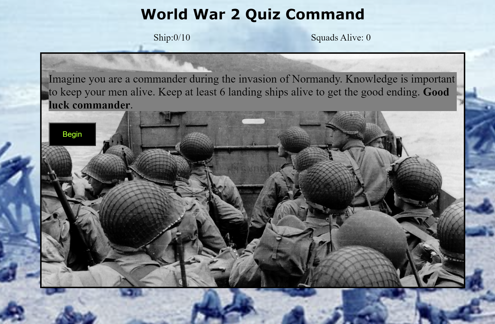
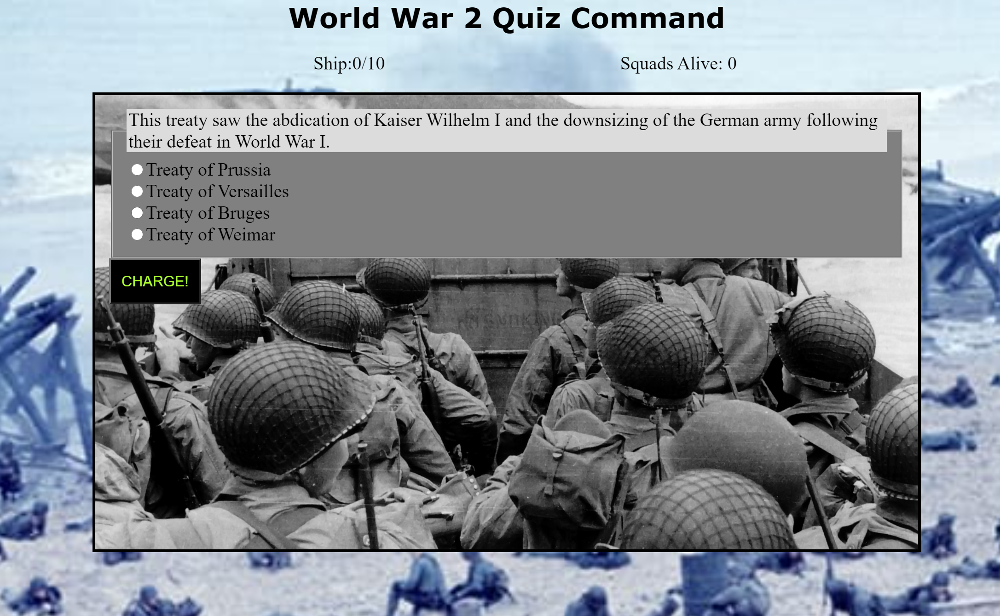

<h1>World War 2 Quiz Command</h1>

Envision yourself as a commander of your own squadron during D-Day. Use your knowledge to lead your squadron to victory with my latest project: World War Quiz Command.

<h2>Motivation</h2>
    
As a history buff, World War 2 was one of my favorite eras of study in school. 

<h2>Demo</h2>
<a href="https://royzone96.github.io/ww-2-quiz-command/">Live Demo</a>
<h2>Screenshots</h2>
    <h3>Landing Page:</h3>
        
    <h3>Question Page</h3>
        
<h2>Built With</h2>
    <h3>Front-End</h3>
        <ul>
            <li>HTML</li>
            <li>CSS</li>
            <li>JavaScript</li>
            <li>jQuery</li>
        </ul>
<h2>Features</h2>
    <ul>
        <li>An ever expanding lexicon of spells and abilities.</li>
    </ul>
<h2>Environment Setup</h2>
    
No API key is needed for this application
.<h2>Development Road Map</h2>
    
